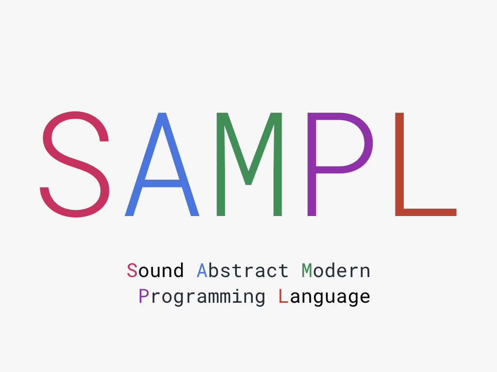

# SAMPL - Sound And Modern Programming Language

It is a JVM language that embraces the functional programming paradigm, which currently supports 
immutable data structures, null safety, pattern matching, currying, limited type inference, and 
limited interop with other JVM languages.

## Scope of this Project

This project aims to implement a type-checker, interpreter, and compiler for this language. 

The type-checker will be invoked before both interpretation and compilation to reject all ill-formed
code before running. We aim to design a sound type system for this language without any 
qualification, so this language does not support type cast that can potentially produce type errors
at runtime.

The interpreter will not be an REPL. Instead, it only supports the interpretation of an entire 
program. The compiler will compile the source code of this language to Kotlin code, then invoke
the Kotlin compiler to compile it to Java bytecode. This design allows rapid prototyping and lets
the generated bytecode have excellent integration with Kotlin codebase.

## Documentations

**Note: Currently, the documentations listed below are very incomplete.**

- Read the [language spec](./LANGUAGE_SPEC.md) for a precise definition of the language features.

- Read the [design document](./DESIGN_DOCS.md) to understand the overall design and architecture.

## Developer Notes

To reduce the size of the package, we do not add the Kotlin compiler as a dependency. If you need
a self-contained package, you can easily wrap it. The reason is that people may only need the 
interpreter features, so the 30M Kotlin compiler is completely useless to them.
